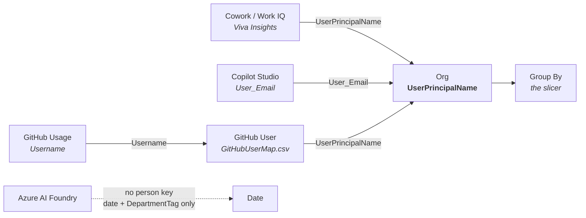

# How to read this dashboard

Sixteen pages, one question each. This is what the numbers mean, where they come from, and — just
as important — **what they can't tell you**.

If you only read one section, make it [When the numbers look wrong](#when-the-numbers-look-wrong).

---

## How everything joins

One key holds the model together: **`UserPrincipalName`**. Every product reaches it, but by
different routes, which is why "there's no common join" is a reasonable first impression.

| Product | How it reaches a person | Needs |
|---|---|---|
| **Cowork / Work IQ** | Direct on UPN | Identification **on** in Viva |
| **Copilot Studio** | `User_Email` → UPN | Nothing — email is in the export |
| **GitHub Copilot** | `Username` → `GitHubUserMap.csv` → UPN | That map file |
| **Azure AI Foundry** | **Never** — no person key exists | — |

**Azure is deliberately different.** Azure bills *resources*, not people. There is no user identity
anywhere in the billing export, so per-person attribution isn't something the template chose not to
do — it isn't possible. Azure joins on **date**, and can be split by **`DepartmentTag`** if you tag
your resources.

> **If Viva is de-identified**, the Cowork arrow above doesn't exist. Cowork totals stay correct but
> stand alone — no per-person view, no departments.
> **[How to turn identification on →](../README.md#viva-identification)**

---

## Dates, and why Studio behaves differently

Not every product reports time the same way, and one doesn't report it at all.

| Product | Grain | Joins the Date table? |
|---|---|---|
| **Cowork / Work IQ** | Weekly | ✅ `MetricDate` |
| **GitHub Copilot** | Per transaction | ✅ `Usage_Date` |
| **Azure AI Foundry** | Daily | ✅ `UsageDate` |
| **Copilot Studio — tenant** | Daily | `Usage_Date` present |
| **Copilot Studio — per user** | **None** | ❌ |
| **Copilot Studio — per agent** | **None** | ❌ |

**Microsoft's Studio per-user and per-agent exports carry no date column at all.** They are
point-in-time snapshots of the whole extract.

The consequence, which is easy to miss:

> **The Studio period slicer scopes the tenant-level trend and entitlement figures only.**
> Per-user and per-agent visuals always show everything in the file, whatever period you pick.

That is a limitation of the export, not the template — there is no date to filter on. The Studio
pages say so where it matters, but it's worth knowing before you reconcile a per-agent number
against a date-filtered total and find they disagree.

---

## The pages

Sixteen in all — fourteen that answer something, plus **Start here** and **Glossary**.

| Page | Answers |
|---|---|
| **Start here** | What do I need, and have I got it? |
| **0. Overall: Combined** | What are we spending across every product, and who drives it? |

Then the same four questions per product:

| | Consumption | Cost | Optimization | Forecast |
|---|---|---|---|---|
| **Cowork / Work IQ** | 1 | 2 | 3 | 4 |
| **Copilot Studio** | 5 | 6 | 7 | 8 |
| **GitHub Copilot** | 10 | 11 | 12 | 13 |

| Question | What it means |
|---|---|
| **Consumption** | Who is using it, and how much? |
| **Cost** | What does that convert to in money? |
| **Optimization** | Where is money being wasted? |
| **Forecast** | Where does this land if nothing changes? |

**Azure AI Foundry has a single page — 9. Foundry: Spend & Efficiency** — rather than four. There's
no per-user identity in Azure billing, so the consumption/optimisation split that works for the
other three has nothing to hang on.

---

## Reading the key figures

### Usage Intensity — three attributes, not one

Each product has its own cohort: **Usage Intensity (Cowork)**, **(Studio)**, **(GitHub)**. Everyone
is ranked against their peers *in that product* and lands in one of six bands:

| Band | Percentile |
|---|---|
| 1. Light | Bottom 50% |
| 2. Regular | Top 25–50% |
| 3. Engaged | Top 10–25% |
| 4. Native | Top 5–10% |
| 5. Power | Top 1–5% |
| 6. Frontier | Top 1% |

**Why three separate attributes rather than one?** Because a person who uses two products would
otherwise appear in two bands at once and their credits would be counted twice. Keeping them apart
means one attribute always equals one row per person.

They are **relative, not absolute**. "Light" doesn't mean low usage — it means lower than most
colleagues. In a heavily-adopted tenant a Light user may still be spending real money.

### Budget buckets

| Bucket | Meaning |
|---|---|
| **Under Limit** | Below 85% of their spending-policy limit |
| **Approaching** | 85–100% |
| **Over Limit** | Above 100%, *or* any usage against a zero limit |

That last clause matters: someone consuming credits with **no** limit set counts as Over Limit, not
Under. It's usually a policy gap rather than a spending problem.

### Forecast

Fitted from the trend across whatever history you've loaded — so **more weeks means a better
forecast**. With four weeks it's barely more than a straight line. It assumes behaviour continues
as-is: it cannot know about a rollout next month or a licence change.

### Concentration ("top 10% share")

What proportion of credits the heaviest 10% consume. High concentration isn't automatically bad —
but it tells you whether spend is broad adoption or a handful of enthusiasts, and those two need
very different responses.

---

## When the numbers look wrong

| What you see | Why | Fix |
|---|---|---|
| **Department blank or "Unknown"** | No org data, or Viva de-identified | Add `entra_org.csv`, or [enable identification](../README.md#viva-identification) |
| **Cowork totals right, but no per-person view** | Viva de-identified — hash, not UPN | Enable identification, or include `PersonPolicyMap.csv` |
| **GitHub users show as usernames, not people** | `GitHubUserMap.csv` missing | Add it — it's the only UPN bridge for GitHub |
| **Studio per-agent ignores the date filter** | Those exports carry no date | Expected. Only tenant-level Studio is date-aware |
| **Azure won't split by person** | No user identity in Azure billing | Not possible. Use `DepartmentTag` |
| **A whole product's pages are empty** | That source wasn't loaded | Expected — pages fill in when data arrives |
| **Someone appears twice in a total** | Usually two spending policies, or a cohort used as a filter across products | Check the Group By attribute is a single product's cohort |
| **Forecast looks implausible** | Too little history | Load more weeks |
| **Cost doesn't match the invoice** | Credit rate, or PAYG vs prepaid | Check the rate parameters against your agreement |

---

## What this dashboard cannot tell you

Worth being straight about, because these come up:

- **What anyone actually asked Copilot.** No prompt or response content — only that an interaction
  was billed.
- **Whether the money was well spent.** It measures consumption and cost, not value or outcome.
- **Per-user Azure AI cost.** Structurally impossible from billing data.
- **Anything about people not in the exports.** Someone licensed but never active may not appear at
  all, depending on the source.
- **Why usage changed.** It shows the shape, not the cause.

---

## See also

- **[Data sources](DATA-SOURCES.md)** — every file, column and export, and where to get it
- **[Measures](MEASURES.md)** — what each measure calculates
- **[Commercial terms](COMMERCIAL-TERMS.md)** — credits, rates, allowances
- **[Org data](ORG-DATA.md)** — department breakdowns in detail
